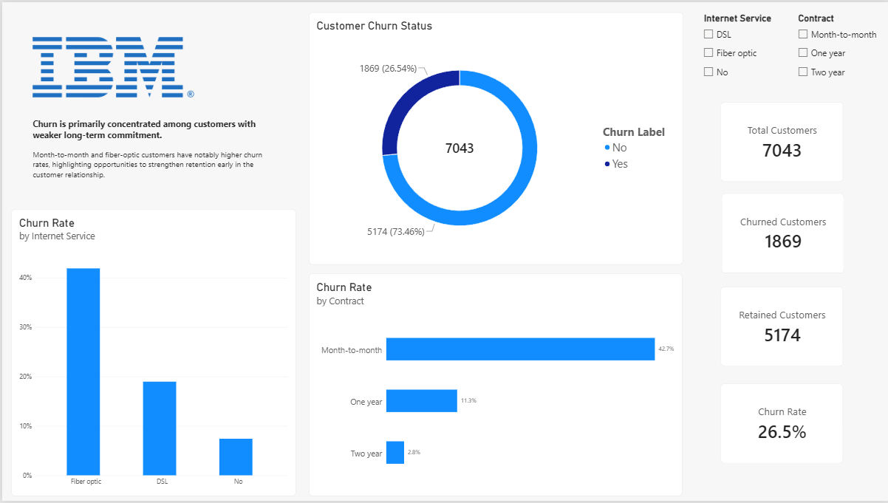
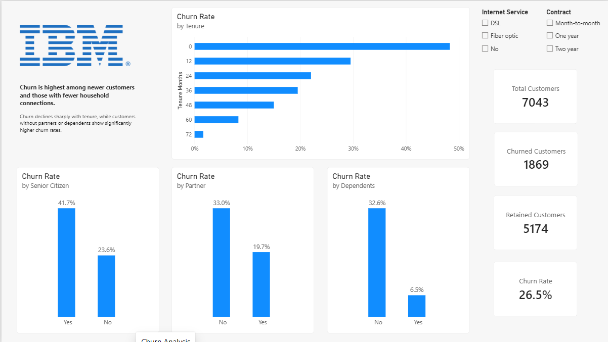

# Telco Customer Churn Analytics

## Overview

A data analysis project investigating customer churn for a fictional telecommunications company providing home phone and Internet services.

The dataset contains 7,043 customers in California during Q3, covering demographics, tenure, services, contracts, billing, charges, churn, customer value, and churn reasons.

The objective is to identify customer segments and factors associated with higher churn and translate the findings into potential retention opportunities.

## Approach

This is primarily a SQL-based analytics project. The work will include data profiling, data cleaning, exploratory analysis, customer segmentation, and analysis of churn and customer value. Power BI will be used later to present the main findings in a business-focused dashboard.

## Dataset

The dataset was obtained from Kaggle and contains 7,043 customer records and 33 variables.

The original dataset is stored in `data/raw`. Field definitions and data preparation decisions are documented in `documentation/data_dictionary.md`.

## Key Questions

The analysis will focus on questions such as:

* What is the overall churn rate?
* Which customer segments have the highest churn?
* How does churn vary by contract and tenure?
* Which services are associated with higher or lower churn?
* How do monthly charges and customer value relate to churn?
* What are the main reasons customers leave?
* What retention opportunities can be identified?

## Tools

* **MySQL** — Data preparation, validation, exploratory analysis, cross-analysis, and SQL JOIN analysis
* **Power BI** — Interactive dashboards and business visualization
* **Excel** — Original source dataset
* **Git/GitHub** — Version control and project documentation

## Analysis

The SQL analysis covers:

* Data validation and quality checks
* Customer and financial profiling
* Churn analysis by contract, payment method, tenure, and services
* Cross-analysis of key churn factors
* JOIN-based customer segment analysis
* Business insights and retention analysis

## Key Findings

* Month-to-month customers have substantially higher churn than customers on longer-term contracts.
* Electronic-check customers show higher churn across all contract types.
* Churned customers have higher average monthly charges than retained customers across all contract types.
* Churn is particularly high among newer customers and decreases as tenure increases.
* Several customer and service characteristics are associated with elevated churn and may warrant targeted retention strategies.

## Power BI Dashboard

The current report includes two pages:

### Executive Overview

### Churn Analysis

## Project Structure

The repository contains the original and cleaned datasets, SQL scripts, project documentation, Power BI files, and supporting screenshots or exports.

## Next Phase

The next phase will focus on customer value and retention analysis, followed by final business recommendations and portfolio documentation.

## Disclaimer

This project uses a fictional telecommunications dataset for analytical and educational purposes.